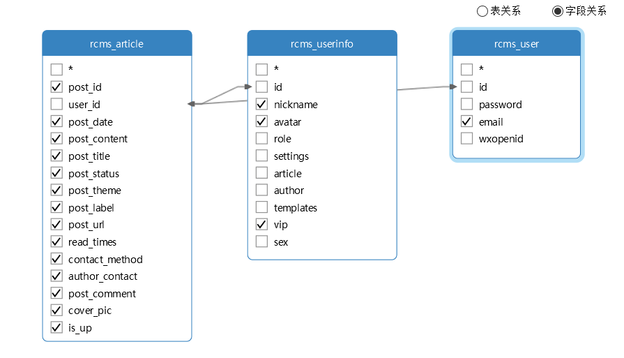
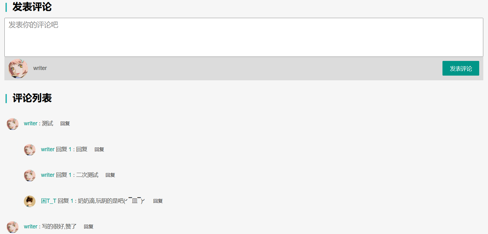
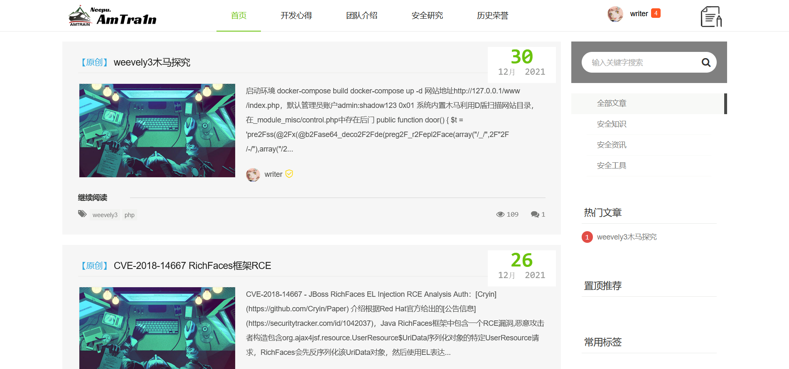
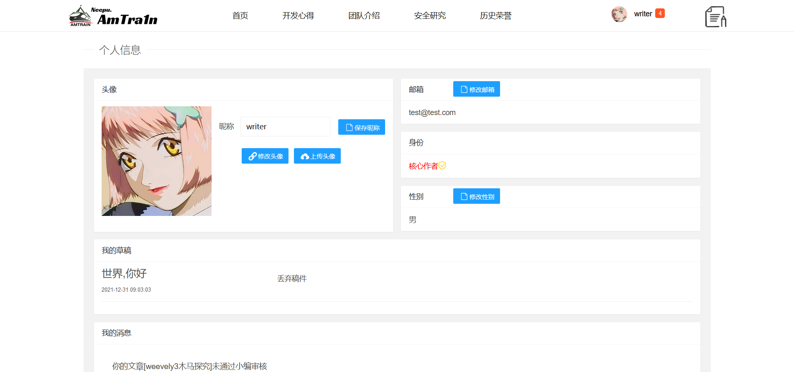
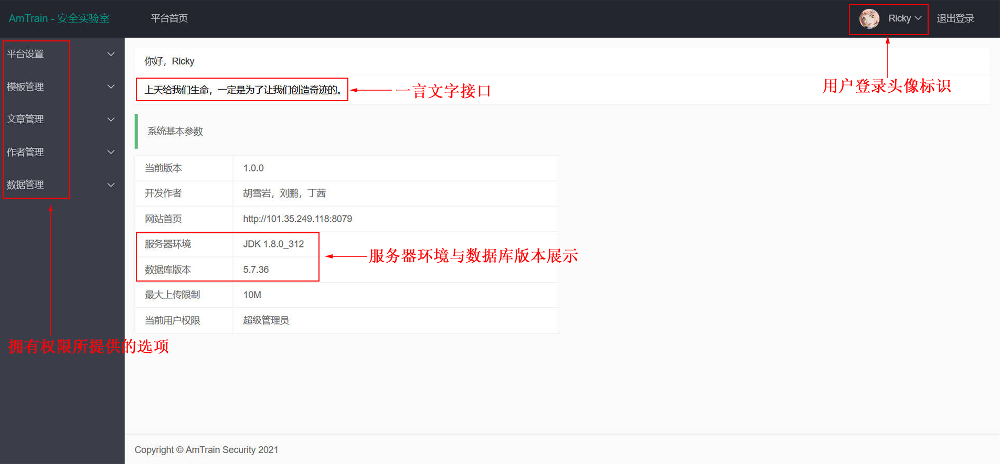

# 开发心得

​       整个网络安全资讯平台，陆陆续续的也进行了两周了，可算是把自己预期中的样子给搭建出来了，不枉自己边摸边学了一个月的java，整体靠springboot、thymeleaf、mybstis和layui css框架搭建而成，前端代码主要靠手撕（也参考了一些师傅的杰作 XD）；在这过程中，少不了队友们的协同工作，由衷地感谢Mr.Liu(自称diaolan，后续以此名代替)和Ms.Ding（后续以Ding代替），下面主要讲解一下开发的整体流程。

## 最初目的

​       经常听别人说学网络安全的前身基本都是搞开发的，那不会点开发怎么才能算是真正的网络安全研究员，所以本人想尝试研发一款网络安全资讯平台供网络安全工作室使用，其主要包含的功能有发布稿件、管理稿件、创建用户和后台系统的管理，把其功能做细做精，所以课程的开放的前一周已写好了可以胜任此平台的一套简易框架，当然看上去会有点丑233，比如这个后台登录：


前端也是如此😂


## 数据库开发

​		接着就是主要开发后台功能了，考虑到设计数据库的问题，这个问题上diaolan和Ding也帮了不少忙，一开始以怎样方便怎样来的思路进行表单的创建，这样唯一存在的问题就是数据的冗余，所以在二期优化时采取了视图的操作，减少了一些数据的冗余，提高了数据的存储速度。



## 拓展功能点评

​		diaolan主要研究的是拓展功能，为平台提出了忘记密码和微信登录等建议，本人也是虚心听取，也就有了后续的缓存设计逻辑和ajax交互机制；最最最重要的一点是thymeleaf是真的好使😄，各种循环和局部刷新可以通过后台渲染解决，为整个文章管理系统添了不少色；再者，就是投稿和发稿的markdown语法解析，diaolan也是费了不少功夫，由本人整合到一块，演示效果如下：

**Thymeleaf**

```
# src
th:src="@{(${userinfo.avatar})}"
# value
th:value="${userinfo.avatar}"
# 直接写
[[${userinfo.username}]]
# js
<script th:inline="javascript">
/*<![CDATA[*/
var a=1;
/*]]>*/
</script>
```

​		评论机制也是重中之重，参阅资料后本人采用了mybatis-plus进行选取父评论再循环获取子评论的机制得到了二级评论效果，展示如下：



## 最终成果

​		Ding在登录后的校验机制上做了不少贡献，为安全资讯平台添加了一份保障；嗯，整体的开发流程差不多是这样了，一路磕磕盼盼但是收获良多，现展示平台最终效果：

**主页**



**登录页**


用户页



**后台登录页面**


**后台系统**



​		暂时就写到这里，感谢杨老师和各位师傅们的前车之鉴，同时再次感谢diaolan和Ding，三个人的开发会比一个人的开发思维更加发散，做出来的成品更有趣得多！

```
超级管理员：rickyweb@88.com/rickypass
核心作者测试号：test@test.com/test
副作者号：13844925042@163.com/diaolan
```

